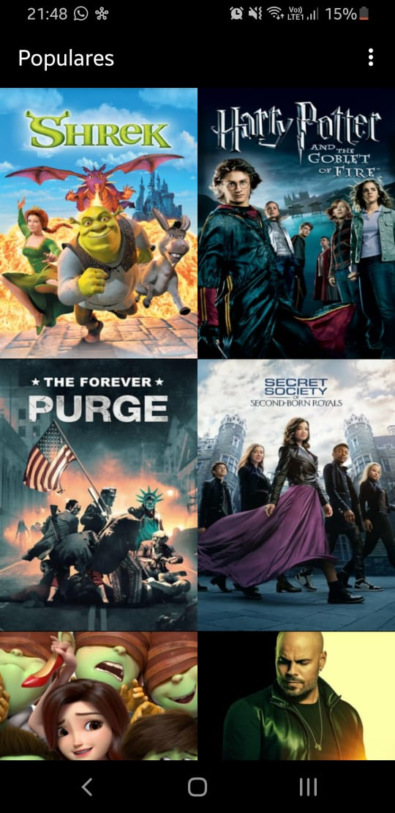
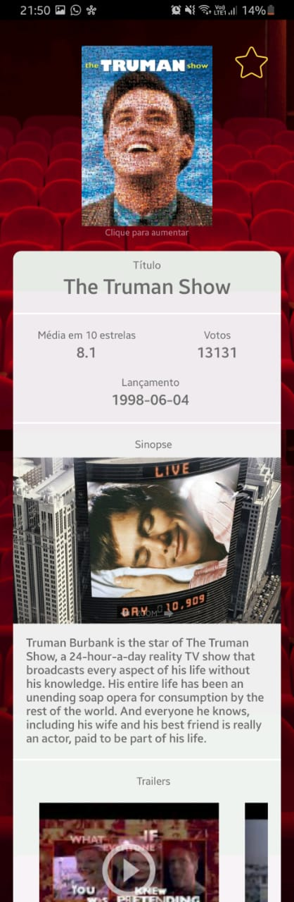
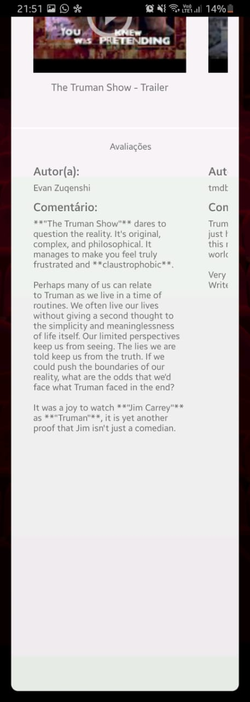

## FamousMovies
#### Created by `Arthur Munhoz`

Android app designed for the Android Developer course from Udacity to search for movies and see its details, trailers and reviews.
It was developed mainly in Java, and I used some cool libraries such as Picasso to render the images, Retrofit2 to make http request and a local database to store the data about your favorite movies.

# Screenshots

